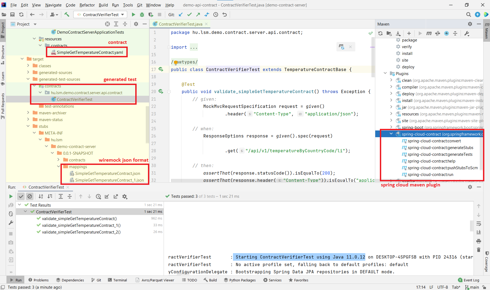

# Spring Boot Contract test demo

## Bevezető
Napjainkban, a [poliglot](https://en.wikipedia.org/wiki/Polyglot_(computing)) 
világban egyre több helyen kezdik alkalmazni a hagyományos REST definiciók helyett az 
[API first](https://swagger.io/resources/articles/adopting-an-api-first-approach/) 
megközelítést. Ennek alapja az [OpenAPI](https://www.openapis.org/) 
definíció, aminek segítségével lényegében egy szabványos 
leírás alapján készülhet az implementáció, ami jelentősen könnyítheti a különböző csapatok közötti együttműködést.
Gyakorlati szempontból a [Swagger](https://swagger.io/specification/) leírása tekinthető mintának.

Sajnos saját tapasztalat, hogy ez nem mindig elegendő. Emellett az API definíciónak pontosnak illene lenni, mert
ha telerakják Map<String, Object> formátumú elemekkel a leírást, akkor nem sokra fognak menni a jövendőbeli 
kliensek, és kénytelenek lesznek a dokumentációt bújni vagy mindennel a produceer oldalt zaklatni.

A [Spring Cloud Contract](https://cloud.spring.io/spring-cloud-contract/) 
a fenti együttműködésre próbál megoldást kínálni, kényelmes felületet biztosítva
mind a producer, mind a consumer oldal számára. 

## Technológiák
A következő két videót érdemes megnézni. [Marcin Grzejszczak](https://toomuchcoding.com/) az egyik vezető 
fejlesztője a Spring Cloud Contract könyvtárnak.

[](https://www.youtube.com/watch?v=yQjcDlibdWM)

[](https://www.youtube.com/watch?v=sAAklvxmPmk&t=540s)

A Spring Cloud Contract lényegében a [wiremock](http://wiremock.org/) alapjaira építkezik. 
YAML vagy Groovy formában definiálhatjuk a 
contractjainkat, majd abból a wiremock formátumának megfelelő JSON készül. Ezt JAR-ba csomagolja, de standalone módban
is képes futtatni. A producer/szerver oldal számára képes teszteket generálni, ami a JSON-t használja bemenetnek,
és több féle formátumban is képes automatikusan tesztet generálni ( [Groovy SPOCK](https://spockframework.org/) 
vagy jUnit5 amit mindenképp említsünk meg). Ezen túlmenően a becsomagolt szabvány formátumú JAR file-t 
képes használni a kliens oldali teszteknél, mint alább látható:

```java
@RunWith(SpringRunner.class)
@SpringBootTest(webEnvironment=WebEnvironment.NONE)
@AutoConfigureStubRunner(ids = {"com.example:http-server-dsl:+:stubs:6565"},
        stubsMode = StubRunnerProperties.StubsMode.LOCAL)
public class LoanApplicationServiceTests {
    . . .
}
```

## Példa alkalmazás definíció
Vegyünk egy minta alkalmazást, ahol a fent leírtak bemutathatóak. Legyen Spring boot microservice, szeparált API
leírással, egy generált vázat implementáló szerver oldallal és egy klienssel.

- [API](../demo-contract-api/README.md)
- [Szerver oldal](../demo-contract-server/README.md)
- [Kliens oldal](../demo-contract-client/README.md)

A példa szerver alkalmazás első verziója a kért ország legutolsó év átlaghőmérsékletét adja vissza. 
Ezt nyilván tovább érdemes fejleszteni, ezért már rögtön adatbázist is teszünk alá. 

A kliens oldal szintén egy faék egyszerűségű alkalmazás, ami kiírja paraméterként kapott országok közül a
legmagasabb átlaghőmérsékletű ország(okat). Azért lehet több is, mert előfordulhat egyezőség is.

## A verzió 1.0 megvalósítása
### API
Itt a legfontosabb az [API definíció](../demo-contract-api/src/main/resources/openapi/v1/demo-contract-openapi.yaml),
illetve a Maven OpenAPI generáló pluginjei. Az [OpenAPI Generator](https://github.com/OpenAPITools/openapi-generator) 
használtam, de a [Swagger](https://swagger.io/tools/swagger-codegen/) 
féle szerintem kicsit többet tud.

Ne tévesszen meg senkit, hogy az alkalmazások egy projektként vannak az idea-ban, ezek nem Maven submodule-ok!
Elviekben teljesen független alkalmazás az összes.
Csak azért maradt ez a forma, hogy a minta egyben kezelhető legyen. A kliens oldalhoz alap RestTemplate kliens is 
készül, míg a szerver oldal implementáció nélkül, csak a stub-okat generálva kerül be a jar fájlba.

Igazán szép az lenne, ha az API leírás és a kontraktok egy önálló git repository-ban lennének, de most egy kicsit
egyszerűsítettem. Ennek eredménye, hogy az API is egy mini maven elem, ami képes Java JAR-t generálni. Természetesen
az OpenAPI yaml formátumából bármilyen egyéb kliens is készíthető.

Az _mvn install_ parancs alapértelmezés szerint fel is teszi az elkészült csomagot a local repository-ba, így
utána már tudunk hivatkozni rá függőségként.

### Szerver oldal (Producer)
Az alkalmazás a továbbfejleszthetőség jegyében egy szimple H2 adatbázisban tárolja az adatait, most elsőre csak az
országkód és aktuális éves átlaghőmérsékletet. Ehhez a Spring JPA tökéletesen elegendő. A [Liquibase](https://www.liquibase.org/)
használjuk az adatbázis változások követésére, és ezzel töltjük is ki alapértelmezett adatokkal.  

A [Spring Cloud Contract Maven plugin](https://cloud.spring.io/spring-cloud-contract/spring-cloud-contract-maven-plugin/plugin-info.html) 
jelentősen megkönnyíti a munkánkat, mert segítségével nem kell parancssori paraméterekkel varázsolni, elég, ha
a pom.xml-ben definiáljuk a releváns részeket. A legfontosabb paraméter a baseClassForTests, ami megadja, hogy
a generált tesztjeink miből származzanak. 

```xml
<plugin>
    <groupId>org.springframework.cloud</groupId>
    <artifactId>spring-cloud-contract-maven-plugin</artifactId>
    <version>3.0.4</version>
    <extensions>true</extensions>
    <configuration>
        <baseClassForTests>hu.lsm.demo.contract.server.api.contract.TemperatureContractBase</baseClassForTests>
        <testFramework>JUNIT5</testFramework>
    </configuration>
</plugin>
```
Itt több mapping-et is meg lehet adni, mert előfordulhat, hogy különböző típusú tesztekhez más-más környezetet
szeretne látni az alkotó. 
```xml
...
<configuration>
    <baseClassForTests>hu.lsm.demo.contract.server.api.contract.TemperatureContractBase</baseClassForTests>
    <baseClassMappings>
        <baseClassMapping>
            <contractPackageRegex>.*com.*</contractPackageRegex>
            <baseClassFQN>com.example.TestBase</baseClassFQN>
        </baseClassMapping>
    </baseClassMappings>
</configuration>
...
```
Érdemes megemlíteni, hogy esete válogatja, valamint a csapat döntésén is múlik, hogy
milyen mélységig szeretné legyártani a tesztet. Mert noha igaz, hogy ki lehet mockolni rögtön a controller
alatti részt, és ezzel teljesíteni a contract tesztet, de sok érv szól a mellett is, hogy ha az alkalmazás mélyén
valamit megváltoztatunk, ami kihat a kimenetre is, akkor ezt az esetet nem fogja lefedni a contract teszt. Örök
kérdés, hogy hol is húzódik a funkcionális teszt határa...

A contractokat alapértelmezés szerint a _resources/contracts_ könyvtárban keresi, és jelenleg YAML és Groovy 
formában definiált szerződésekkel birkózik meg. Egy YAML fájlban több contractot is meg lehet adni. Ezek után 
a convert funkcióval el lehet készíteni a wiremock formátumú JSON-t, amiből egy stub jar is készül. 
Alapértelmezés szerint ezek a maven generate lépésnél meg is történnek, de kézzel is futtathatóak.

Végül egy kis trükkel a [Maven install plugin](https://maven.apache.org/plugins/maven-install-plugin/examples/installing-secondary-artifacts.html#) 
'classifier' parametere segítségével a local Maven repoba fel tudjuk tolteni a stub jar-okat. 
Lehetne használni a Contract plugin SCM feltöltőjét is, de ahhoz egy SSH kulcs is kell a git felé,
de ez a példa inkább a standalone működő megoldást célozza.

Futtatás:
```shell
mvnw spring-boot:run
```
### Kliens oldal (Consumer)
A kliens oldal szintén Spring boot alkalmazás, csak web réteg nélkül, amit az application.properties egy 
sorával érhetünk el:
```properties
spring.main.web-application-type=none
```
A kliens kódja lényegében az API projectben generált osztályokban található, csak az URL-t állítjuk be kézzel,
ezt természetesen a szabványos Spring paraméterezéssel felül is írhatjuk.

Érdekességként a [TemperatureStartupArgumentCollector](../demo-contract-client/src/main/java/hu/lsm/demo/contract/client/startup/TemperatureStartupArgumentCollector.java)
osztályban látható, hogy miként veszünk át paramétert a parancssorból.

Futtatás:
```shell
mvnw spring-boot:run -Dspring-boot.run.arguments=--temperature.countryList=hu,li
```

A lényegi contract teszt a [TemperatureClientContractTest](../demo-contract-client/src/test/java/hu/lsm/demo/contract/client/TemperatureClientContractTest.java)
osztályban látható. A lényeg az annotációban van, de ha lefuttatjuk, látható, hogy a Spring Cloud Contract
indít egy Wiremock szervert, amibe betölti a stub-ban megadott contractokat. A paraméterben látható, hogy
_stubsMode = StubRunnerProperties.StubsMode.LOCAL_ használok, ami a helyi repositoryból próbálja meg feloldani
a jar-t. Amennyiben távoli elérést szeretnénk, akkor _REMOTE_ a megfelelő, és ilyen esetben akár gitben is
tárolhatjuk a contractjainkat. 

Itt említsük meg, hogy látható, hogy a verziót most bevéstem az annotáció paraméterébe és a fixált port miatt a 
@DirtyContext annotációra is szükség van. Mindkettő opcionális. Első helyett inkább a '+' jelet érdemes használni,
így mindig a legutolsó verziót fogja próbálni betölteni. De ha tudod, hogy a release-ben az _x.y.z_ verzió megy ki,
akkor nyilván ahhoz igazítod a tesztedet.

## Integráció
Készült egy [build script](../build.sh), ahol egyben lefuttat mindent, amire csak szükség van. Itt megemlíteném
a takari fele maven wrapper begyűjtőt, ami segít abban, hogy ne kelljen a bináris wrappert mellékelni.
```shell
mvn io.takari:maven:wrapper
```

## Továbbfejlesztések

A következőkben érdemes lehet bemutatni, hogy az API változása hogyan hat a contractok-ra. De most az alapok 
megismerésére ennyi elegendő.

## Képernyőképek


## Hasznos linkek
- https://cloud.spring.io/spring-cloud-contract/reference/html/
- https://stackoverflow.com/questions/4955635/how-to-add-local-jar-files-to-a-maven-project
- https://medium.com/better-practices/api-first-software-development-for-modern-organizations-fdbfba9a66d3
- https://www.baeldung.com/spring-boot-command-line-arguments